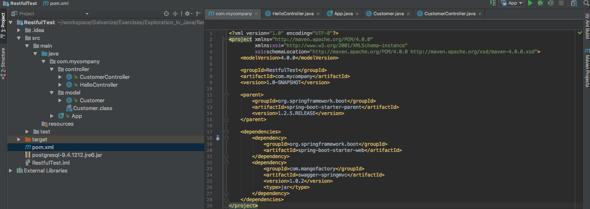
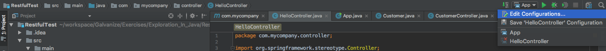

## An Exploration in Java

### Outline:

#### Intro (describing Java and Spring)
#### Why use Java? (describe benefits of Java over other programming languages)
#### How do I use Java? (highlight some of Java's peculiarities)
###### Using Spring (describe how to start a REST api using spring)
###### Spring subsection: Maven and IDE (describe Maven and IDE needed to be used)
###### Spring subsection: Starting a Maven with spring (start a Spring Maven project and get it to say "Hello World!!")
###### Spring subsection: Building CRUD (build CRUD into spring-based API)

#### Introduction:
This is going to be a short tutorial about Java the programming language and building a mostly REST compliant API server using the Spring framework in Java. It assumes that you have a basic knowledge of programming concepts and some familiarity with how to install and use packages and libraries.

Java is a programming language created by Sun Microsystems in 1995, and it would not be a stretch to say it is now the most popular programming language in existence. It is a general purpose, class-based, object-oriented language, and in the creation of java there were 5 principles:

1. It must be "simple, object-oriented, and familiar".
1. It must be "robust and secure".
1. It must be "architecture-neutral and portable".
1. It must execute with "high performance".
1. It must be "interpreted, threaded, and dynamic".

It is somewhat unique in that all of the code must be in classes. Scripting can sort of be done, but it must be inside of a class and then the script can be put inside the main method of that class, here's a hello world program in Java:
``` Java
class HelloWorld {
    public static void main(String[] args) {
        System.out.println("Hello World!"); // print 'Hello World!' to the console
    }
}
```
It is also a strongly typed language, meaning that each type of data (integer, character, hexadecimal, etc.) are predefined and all variables must be described with one of those given data types. It is also compiled as opposed to interpreted. For example, creating an integer variable with a value of 7 would look like this:
```Java
int x = 7;
```
and creating a string "Hello World!" would be:
```Java
String x = "Hello World!";
```

#### Why use Java?
So with these rather inconvenient drawbacks (OOP being a requirement, strongly typed, etc.), and the unwieldy amounts of code needed to perform simple tasks, why bother using Java? Besides it being incredibly popular and being almost everywhere.

To start off with, those inconveniences can actually be benefits rather than drawbacks. The fact that it forces object-oriented programming forces the first principle of Java. Because of it's nature, people writing code in Java will have more object-oriented code and therefore simpler, easier to read, and hopefully more familiar to code to people who are used to reading Java code. Java being objected-oriented and strongly typed also forces the user to use better programming practices and keeps them from committing some bad programming practices, and forces the user to create more scalable code.

To the second point, Java is robust and platform independent. The Java compiler only half compiles code which is given to the JVM (Java Virtual Machine) installed on a specific platform which understands the half compiled code and processes it for that platform. The secure part comes from the fact that it's strongly typed and that there's no access to the pointers. The JVM also makes Java architecture-neutral and portable, again because the half-compiled code is then executable on many processors.

High performance just means that Java programs run relatively fast. With a "just-in-time compiler" Java code can run in speeds that rival C++. The "just-in-time compiler" compiles methods into native machine code and the JVM calls the compiled code directly instead of interpreting it. This is also because it's a lower-level language relative to languages like Javascript or Python.

Interpreted just means that the Java compiler generates byte-code instead of machine code, and it has built-in constructs for multithreading, but it can still be synchronized. Java is considered dynamic because the bytecode is loaded at runtime, and anything happening at runtime is considered dynamic.

That was probably more information about Java than was strictly necessary, but suffice to say Java is versatile, fast, and promotes good practices.

#### How do I use Java?
Given the heavily object-oriented nature of Java, it makes sense to first go over it's class syntax. One particularity is that the file name must be the same as the main class name, and the main method of that class will run when the program is executed. Another restriction is that the constructor function is denoted by having the same name as the class name, and any function with the same name as the class is the constructor function. Generally the class with the main method won't have a constructor. The following is an example of a class with two integers for parameters:

``` Java
class SampleClass {
    int int1;
    int int2;

    public SampleClass(int int1, int int2) {
        this.int1 = int1;
        this.int2 = int2;
    }
}
```

and this is a class with a main method:

``` Java
class ClassMain {
    public static void main(String[] args) {
        SampleClass newClass = new SampleClass(1, 2);
        System.out.print(newClass.int1);
        // this code will run on execution
    }
}
```

When methods in the class are created, the data type being returned needs to be specified. So adding a method to the sample class that would return one of the held integers would look like this:

``` Java
class SampleClass {
    int int1;
    int int2;

    public SampleClass(int int1, int int2) {
        this.int1 = int1;
        this.int2 = int2;
    }

    public int getInt1() {
        return this.int1;
    }
}
```

If the method doesn't return anything, use the keyword 'void':

```Java
public void incrementInt(int incrementVal) {
    this.int1 += incrementVal;
}
```

Variables can also be made private, in which case only that class can access the variables. For example, if the sample class looks like this:

```Java
class SampleClass {
    private int int1;
    private int int2;

    public SampleClass(int int1, int int2) {
        this.int1 = int1;
        this.int2 = int2;
    }
}
```

Then this will no longer work:

``` Java
class ClassMain {
    public static void main(String[] args) {
        SampleClass newClass = new SampleClass(1, 2);
        System.out.print(newClass.int1); // int1 can no longer be accessed because it's private
        // this code will run on execution
    }
}
```
The static keyword means that the variable or method is on the class itself rather than an instance of the class and doesn't change from instance to instance.

Those are some of the basic differences from Python and Javascript. In this repository you can also find examples of recursive fibonacci and merge sort in Java.

#### Using Spring:
###### Requirements: Maven and an IDE (preferably IntelliJ Community Edition):
Maven is a tool for building and managing Java-based projects and works similar to NPM for node in Javascript, but it's kind of clunky. It manages dependencies in a pom.xml file much like NPM manages dependencies in a package.json file.

IDE stands for integrated development environment and is a software suite that consolidates all of the basic skills that a developer needs to write and test software. Typically an IDE has an editor, compiler/interpreter, and debugger, all in a single GUI. We'll need an IDE to start our server.
###### Starting a Maven Project and Using Spring:
After downloading and installing Maven and IntelliJ (Maven can be brew installed), create a new project in IntelliJ selecting for the Maven option. Give it a group ID, artifact ID, and a name. To get the packages we need, open the pom.xml file and add these dependencies:

``` xml
<parent>
    <groupId>org.springframework.boot</groupId>
    <artifactId>spring-boot-starter-parent</artifactId>
    <version>1.2.5.RELEASE</version>
</parent>

<dependencies>
    <dependency>
        <groupId>org.springframework.boot</groupId>
        <artifactId>spring-boot-starter-web</artifactId>
    </dependency>
    <dependency>
        <groupId>com.mangofactory</groupId>
        <artifactId>swagger-springmvc</artifactId>
        <version>1.0.2</version>
        <type>jar</type>
    </dependency>
</dependencies>
```

These will give the pom a parent object and inherit some of it's properties as well as adding the dependencies we need. Then right-click the pom.xml file and under the maven drop-down option select "Reimport" to import all of the libraries we'll be depending on. Finally, under "directory" > src > main > Java, right click the Java folder and create a new package, and inside that package we'll create our server files. The file directory and pom.xml should end up looking something like this:



We can start by making an entry point for all the rouets, right-click your package folder (mine is com.mycompany) and create two more packages, one for controllers and one for models, and a class to start the server (i.e. App). Inside this file we'll need to require the necessary package and libraries:

```Java
package com.mycompany;

import org.springframework.boot.SpringApplication;
import org.springframework.boot.autoconfigure.EnableAutoConfiguration;
import org.springframework.context.annotation.ComponentScan;
```
Then, before the code for the class itself some annotation types needed to be added. These can be added to source code (classes, methods, variables etc.) to change the performance. For the app class we'll need two annotations to allow access to and use the controllers, @EnableAutoConfiguration and @ComponentScan. The main method will have one line of code that starts the spring application. It should end up looking something like this (after the imports):

```Java
@EnableAutoConfiguration
@ComponentScan("com.mycompany")
public class App {
    public static void main(String[] args) {
        SpringApplication.run(App.class, args);
    }
}
```

We can then add the controllers to the controller package, we'll start with a HelloController class that will simply return "Hello World!!" to get the application running. This will need the @Controller and @RequestMapping("/hello") annotations to make it a controller and to map which HTTP requests are supposed to go through it. RequestMapping can be given an argument "/hello" to ensure that requests to the "/hello" route go through this controller. We'll also need to import the necessary libraries. So we start off with this:

```Java
package com.mycompany.controller;

import org.springframework.stereotype.Controller;
import org.springframework.web.bind.annotation.RequestMapping;
import org.springframework.web.bind.annotation.RequestMethod;
import org.springframework.web.bind.annotation.ResponseBody;

@Controller
@RequestMapping("/hello")
public class HelloController {

}
```

The controller can be given methods to handle different kinds of HTTP requests. These methods will have the @RequestMapping and @ResponseBody annotations. This time @RequestMapping will be given the arguments value = "" and method = RequestMethod.GET to specify this method to take HTTP get requests to "/hello" and @ResponseBody to process the response after receiving an HTTP request. We'll just call the method hello and have it return the string "Hello World!!". So the complete class will look like this (below the import statements):

```Java
@Controller
@RequestMapping("/hello")
public class HelloController {
    @RequestMapping(value = "", method = RequestMethod.GET)
    @ResponseBody
    public String hello() {
        return "Hello World!!";
    }
}
```

And that's the very barebones of a RESTful API using Spring! To get the API up and running we'll have to create a run configuration, click the edit configuration button here:



and select the main class, working directory, and classpath of module. Also make sure it has a JRE (SDK 1.8). After that, run the configuration and try to hit localhost:8080/hello with a get request and "Hello World!!" should print to the screen.

###### Building in CRUD
Cool as having one route that prints "Hello World!!" to the screen is, it doesn't quite comply with CRUD, so add another class to the controller package, this time calling it CustomerController, and add a class to the model package calling it Customer. All of the routes in this controller can be tested with something like Postman or CURL. The company class will have have a private id and a public name and a getter for the id. The name still has a setter function because otherwise it can't be accessed outside of the package it's in:

```Java
package com.mycompany.model;

public class Customer {
    private Long id;
    String name;

    public Customer(Long id, String name) {
        this.id = id;
        this.name = name;
    }

    public Customer() {
        // dummy constructor
    }

    public Long getId() {
        return id;
    }

    public String getName() {
        return name;
    }

    public void setName(String name) {
        this.name = name;
    }
}
```

The dummy constructor is to bypass the default constructor that would, if not bypassed, introduce errors later on in the routes. The CustomerController class will have the similar libraries to the hello controller, as well as the Customer class, a MediaType class to interpret JSON files, and a @RequestBody which behaves similarly to the @ResponseBody, in addition to List and ArrayList to hold our customers. So we'll start off with this:

```Java
package com.mycompany.controller;

import com.mycompany.model.Customer;
import org.springframework.http.MediaType;
import org.springframework.stereotype.Controller;
import org.springframework.web.bind.annotation.*;

import java.util.ArrayList;
import java.util.List;

@Controller
@RequestMapping("/customers")
public class CustomerController {
   private static List<Customer> list = new ArrayList<Customer>();

   static {
       list.add(new Customer(1l, "Johny Johny"));
       list.add(new Customer(2l, "Tommy Tommy"));
   }
}
```

This will start a CustomerController with a list of two customers. The l in "1l" and "2l" denote that the number is a long and not an integer. We'll start with the route to get all of the customers, "index" according to REST. Again, @RequestMapping and @ResponseBody will be used, but this time @RequestMapping will have an extra parameter produces = "MediaType.APPLICATION_JSON_VALUE" so that the controller can respond with a JSON when the list of customers is returned. The method ends up looking like this:

```Java
@RequestMapping(value = "", method = RequestMethod.GET, produces = MediaType.APPLICATION_JSON_VALUE)
@ResponseBody
public List<Customer> getAllCustomers() {
    System.out.println("index hit");
    return list;
}
```

Next is the route to get one customer (by id), the "show" action in REST. This time, the value will be "/{id}" and the method will take an argument with an annotation, @PathVariable("id") Long id. This will take the id when the route "/customers/{id}" is hit and pass it into the method as an argument. Then we can iterate over the list of customers until we find the customer with the correct id and return that customer or return null if no customers with matching ids are found:

```Java
@RequestMapping(value = "/{id}", method = RequestMethod.GET, produces = MediaType.APPLICATION_JSON_VALUE)
@ResponseBody
public Customer getCustomerById(@PathVariable("id") Long id) {
    System.out.println("get hit");

    for (Customer c : list) {
        if (c.getId() == id) {
            return c;
        }
    }

    return null;
}
```

Next is the route for creating a new customer, the "CREATE" action in REST. This time it will also use the @RequestBody annotation to interpret the JSON sent in the @RequestBody and put it through the Customer constructor. The method i nthe @RequestMapping parameters will be RequestMethod.POST and another parameter, consumes = MediaType.APPLICATION_JSON_VALUE will be added so it can take the JSON in the request body, so the route ends up looking like:

```Java
@RequestMapping(value = "", method = RequestMethod.POST, consumes = MediaType.APPLICATION_JSON_VALUE)
@ResponseBody
public List<Customer> addCustomer(@RequestBody Customer customer) {
    System.out.println("post hit");

    for (Customer c : list) {
        if (c.getId() == customer.getId()) {
            System.out.println("already in list");
            return list;
        }
    }

    list.add(customer);
    return list;
}
```

The iterator is to make sure the customer isn't already in the list of customers and terminate if it is. After that is the route for updating a customer, "UPDATE" in REST. This time it will use the HTTP put method, take in a name as a string, and update the customer with the id specified by the path variable:

```Java
@RequestMapping(value = "/{id}", method = RequestMethod.PUT)
@ResponseBody
public void updateCustomer(@PathVariable("id") Long id, @RequestBody String name) {
    System.out.println("create hit");

    for (Customer c : list) {
        if (c.getId() == id) {
            c.setName(name);
        }
    }
}
```

The last route for this exercise is to delete a customer, "DESTROY" in REST. By now, this should be self-explanatory. Request method is delete, it consumes JSON, and @RequestBody interprets the id passed in the request JSON:

```Java
@RequestMapping(value = "", method = RequestMethod.DELETE, consumes = MediaType.APPLICATION_JSON_VALUE)
@ResponseBody
public void deleteCustomer(@RequestBody Long id) {
    System.out.println("delete hit");
    Customer delCustomer = null;

    for (Customer customer : list) {
        if (customer.getId() == id) {
            delCustomer = customer;
        }
    }

    if (delCustomer == null) {
        System.out.println("id does not exist");
    } else {
        list.remove(delCustomer);
    }
}
```

And that's a very barebones REST api using Spring! Sample code of everything described in this tutorial is in this repository in "RestfulTest".
